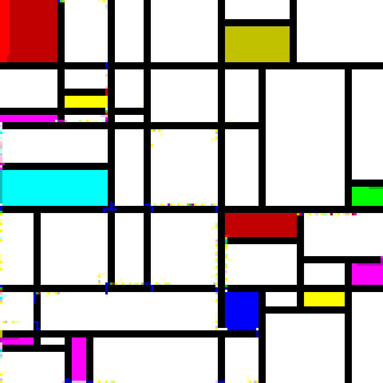

# Riemann-Piet

A rust-based interpreter for [Piet](https://dangermouse.net/esoteric/piet.html), modified to interpret a general topological surface

## Installation and usage

- todo: installation guide

A standard Piet interpreter takes in a single image, and runs the corresponding code. This is possible in Riemann-Piet by running the interpreter on a canvas, as in the example below:

```rust
fn main() {
    // Max number of steps the interpreter will run for before stopping
    let max_heartbeats = 10000;
    // Location of your Piet program
    let img_path = "./piet/src/A_study_of_primes_II.png";
    // Width of codels in the source image
    // Relevant for upscaled images
    let codel_size = 1;

    // Make a canvas from your image
    let mut canvas = Canvas::new(
        &img_path, 
        codel_size
        ).expect("Failed to make canvas");
    // Run the interpreter
    canvas.run(
        &mut Interpreter::new(),
        max_heartbeats
        );
}
```
Every program runnable in [npiet](https://www.bertnase.de/npiet/) should function the same when run as a canvas in Riemann-Piet. If you find an example where the behaviour differs, please get in touch!


The unique feature of Riemann-Piet is that a single image can be replaced with with a _surface_, defined by an _atlas_. An atlas is just a collection of images, with a map defining transitions between them. This is sufficient to describe _any_ topological surface, with or without boundaries!

As an example, you can run the interpreter on a [Klein bottle](https://en.wikipedia.org/wiki/Klein_bottle) using the following code:

```rust
fn main() {
    let max_heartbeats = 100000000;
    let codel_size = 1;
    let img_path = "./piet/src/A_study_of_primes_II.png";

    let mut klein_bottle = Atlas::new_klein_bottle(
        img_path, 
        codel_size
    ).expect("failed to load image");
    klein_bottle.run(
        &mut Interpreter::new(), 
        max_heartbeats
    );
}
```

 - todo: write a program for a klein bottle

## How does it work?

When creating a canvas (`Canvas::new`), Riemann-Piet will first load the source image, then run a simple lexer on the colour blocks, obtaining their size and the possible exit coordinates given different states of the Direction Pointer (DP) and Codel Chooser (CC).

The interpreter will step through the image, starting at the top left. When the interpreter encounters a state change - e.g. a step from one block to another, or encountering a black codel - it will trigger the appropriate action - e.g. executing a Piet command, or changing the interpreter state.

The interpreter will keep going until either it has run for the maximum heartbeats, or until it reaches an inescapable state and terminates.

## Background

### What is Piet?

The artist [Piet Mondrian](https://www.tate.org.uk/art/artists/piet-mondrian-1651) was a pioneer in the field of [geometric abstraction](https://en.wikipedia.org/wiki/Geometric_abstraction), creating the [neo-plasticism](https://www.tate.org.uk/art/art-terms/n/neo-plasticism) movement. His most famous works were stark geometric pieces, canvases filled with rectangles seperated by bold black lines, filled with white, black, or primary colours.


<em> Piet Mondrian, 1921, Tableau I </em>

[David Morgan-Mar](https://en.wikipedia.org/wiki/David_Morgan-Mar) is an Australian physicist known primarily for his many esoteric programming languages, including the 2008 language [Piet](https://dangermouse.net/esoteric/piet.html). Inspired by Mondrian's work, Piet uses images as code, with the transitions between different colours interpreted as instructions for a stack with basic maths and IO capability.



<em> Aberdeen Powell, 2026, A Study of Primes II, codel size 4 </em>

The above image is an example of a Piet program: it will prompt the user to input a number $n$, then test if $n$ is prime, displaying the result. This particular program is based off a design by Kyle Woodward, though the original unfortunately had some minor bugs.

### Who is Riemann?

[Bernhard Riemann](https://en.wikipedia.org/wiki/Bernhard_Riemann) was a German mathematician famous for a number of major contributions to analysis, geometry, and number theory. His work includes the development of the [Riemann integral](https://en.wikipedia.org/wiki/Riemann_integral), the celebrated [Riemann hypothesis](https://en.wikipedia.org/wiki/Riemann_hypothesis), and the field of [Riemannian geometry](https://en.wikipedia.org/wiki/Riemannian_geometry).

He vastly developed our understanding of [Riemann surfaces](https://en.wikipedia.org/wiki/Riemann_surface), complex connected manifolds of one (complex) dimension. Every Riemann surface is a [topological surface](https://en.wikipedia.org/wiki/Surface_(topology)), but the converse isn't true: a topological surface can (non-uniquely) be turned into a Riemann surface if and only if it is orientable and metrizable.

This interpreter runs on non-orientable surfaces (including the `Atlas::klein_bottle` and `Atlas::projective_plane`), but the name "Riemann-Piet" was chosen to honour Riemann's contributions to geometry.
