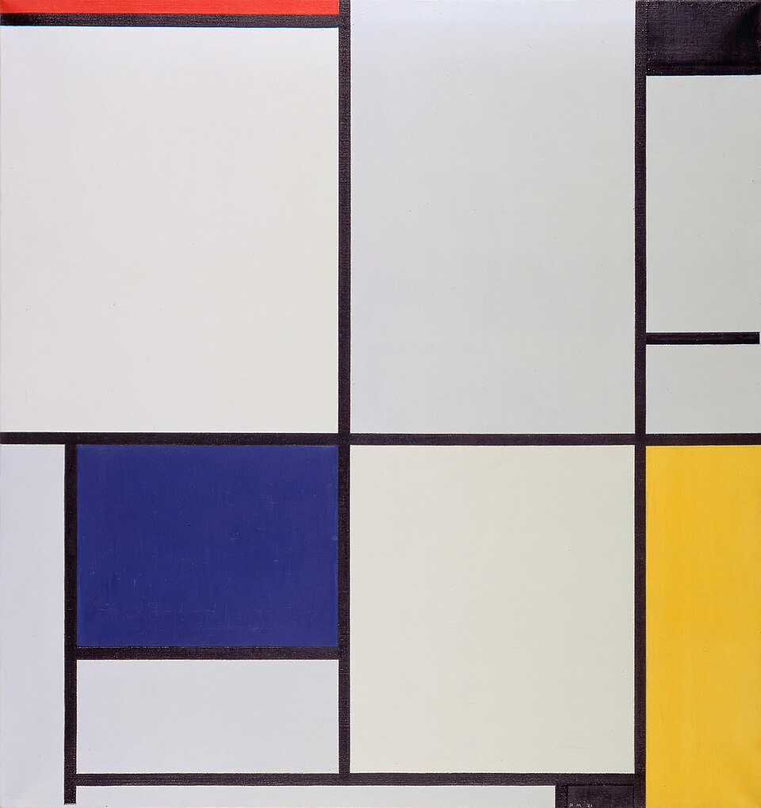

# Riemann-Piet
A rust-based interpreter for Piet, modified to interpret a general topological surface

## What is Piet?

The artist [Piet Mondrian](https://www.tate.org.uk/art/artists/piet-mondrian-1651) was a pioneer in the field of [geometric abstraction](https://en.wikipedia.org/wiki/Geometric_abstraction), creating the [neo-plasticism](https://www.tate.org.uk/art/art-terms/n/neo-plasticism) movement. His most famous works were stark geometric pieces, canvases filled with rectangles seperated by bold black lines, filled with white, black, or primary colours.

<em> Piet Mondrian, 1921, Tableau I </em>

[David Morgan-Mar](https://en.wikipedia.org/wiki/David_Morgan-Mar) is an Australian physicist known primarily for his many esoteric programming languages, including the 2008 language [Piet](https://dangermouse.net/esoteric/piet.html). Inspired by Mondrian's work, Piet uses images as code, with different simple colours (and the transitions between them) interpreted as instructions for a stack with basic IO